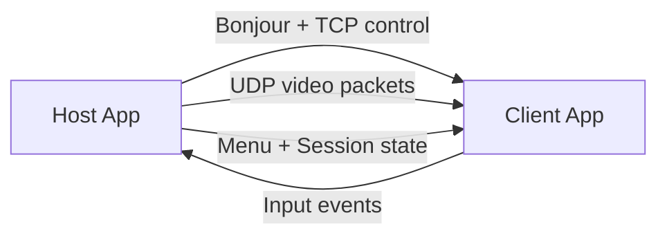
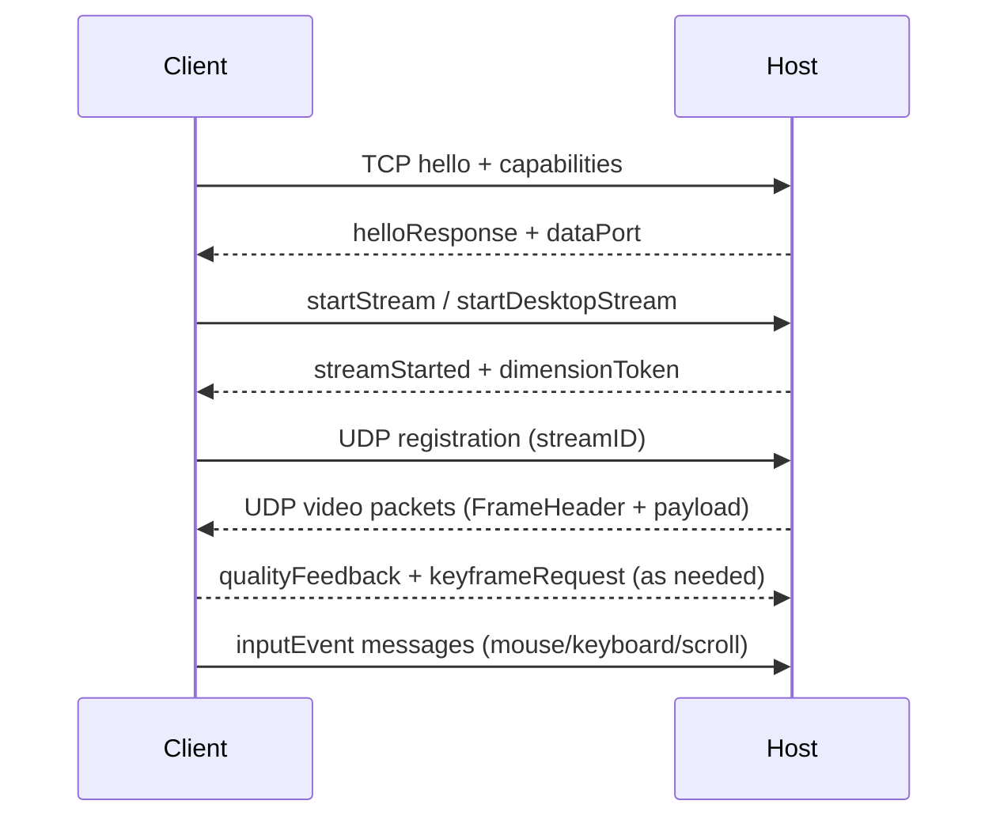
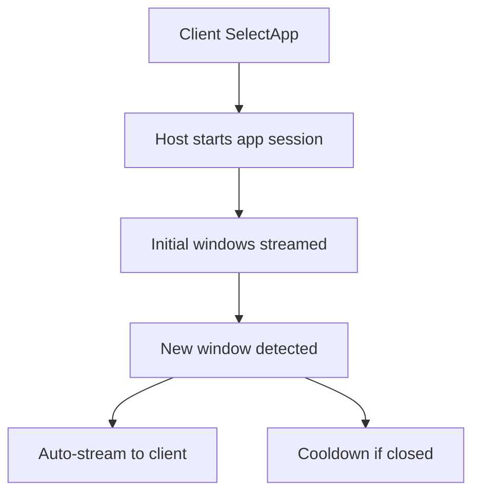
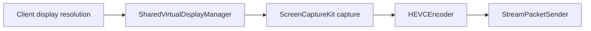

# MirageKit Architecture

This document describes MirageKit’s internal architecture for both integrators and contributors. It covers the major modules, data flows, streaming modes, and performance-focused design choices.

## High-Level Overview

MirageKit is split into host and client stacks:

- **Host (macOS)** captures windows or virtual displays with ScreenCaptureKit, encodes frames with VideoToolbox, fragments packets for UDP transport, and publishes control messages over TCP.
- **Client (macOS/iOS/visionOS)** discovers hosts over Bonjour, connects over TCP for control, receives UDP video packets, reassembles frames, decodes via VideoToolbox, and renders via Metal.

## Module Map

### Public Surface (API)

- `MirageHostService` orchestrates host lifecycle, stream creation, and discovery.
- `MirageClientService` manages discovery, connection, and stream sessions.
- `MirageStreamViewRepresentable` renders streams and forwards input.
- `MirageEncoderConfiguration`, `MirageNetworkConfiguration`, `MirageQualityPreset` configure quality and transport.

### Internal Modules

- **Capture**: `WindowCaptureEngine` wraps ScreenCaptureKit and emits `CapturedFrameInfo` (content rect, dirty regions, keyframe hints).
- **Encoding**: `HEVCEncoder` provides low-latency hardware encoding, per-frame quality control, and keyframe handling.
- **Packetization**: `StreamPacketSender` fragments encoded frames with `FrameHeader` and paces large keyframes.
- **Protocol**: `MirageProtocol` defines header sizes, packet validation, and CRC checks.
- **Network**: `BonjourAdvertiser`, `BonjourBrowser`, `ConnectionManager`, and `HybridTransport` manage TCP/UDP and discovery.
- **Decoding**: `FrameReassembler` rebuilds frames, `HEVCDecoder` handles decoding, and errors trigger keyframe recovery.
- **Rendering**: `MetalRenderer` converts CVPixelBuffer to textures with content-rect cropping.
- **Virtual Display**: `SharedVirtualDisplayManager` manages a single shared virtual display for streams.
- **App Streaming**: `AppStreamManager` tracks bundle-based streaming, window cooldowns, and exclusivity.
- **Session/Unlock**: `SessionStateMonitor` and `UnlockManager` implement login/lock flows.

## End-to-End Data Flow

## Streaming Modes

### Window Streaming

- Captures a specific window using `WindowCaptureEngine`.
- Can opt into virtual display mode if the client provides display resolution.
- Encodes and streams at host-native pixel density to preserve detail.

### Desktop Streaming

- Creates or reuses a shared virtual display.
- Mirrors physical displays into a single virtual surface at the client resolution (capped at 5K).
- Uses `.desktopStream` frame flags for client-side context.

### App-Centric Streaming

- Clients request apps by bundle identifier.
- `AppStreamManager` tracks window creation/closure, cooldown timers, and app termination.
- New windows are auto-attached to the session, and cooldown windows allow graceful UX when apps relaunch.

## Virtual Display Pipeline

A single shared virtual display isolates streamed content and enables 1:1 resolution mapping.

## Transport and Protocol

- **TCP control**: `ControlMessage` envelopes typed JSON payloads (window lists, input events, session state, app streaming, menu bar).
- **UDP video**: `FrameHeader` carries sequencing, checksum, content rect, and dimension tokens.
- **Peer-to-peer**: `enablePeerToPeer` configures AWDL for discovery and transport.
- **Fragmentation**: large encoded frames are split into multiple UDP packets; keyframes are paced to reduce burst loss.

## Quality and Performance Tuning

### Quality Presets

`MirageQualityPreset` configures bitrate and frame rate caps. `.lowLatency` uses aggressive frame skipping and smaller keyframes for responsiveness.

### Adaptive Bitrate

`StreamContext` tracks queue delay, dirty region sizes, and quality feedback from the client to scale bitrate smoothly.

### Keyframe Strategy

- Keyframe interval defaults to 10s to reduce periodic spikes.
- `forceImmediateKeyframe()` is used when the client registers late or after decoder issues.

### Decode Recovery

- `HEVCDecoder` blocks input when decode errors spike.
- `FrameReassembler` can discard mismatched dimension tokens and request keyframes.

## Input Pipeline

- Input events are sent as `MirageInputEvent` over TCP.
- Host uses a fast input queue and `InputStreamCacheActor` to translate coordinates without blocking UI.
- Mouse locations are normalized in client views to preserve precision across dynamic sizes.

## Rendering Pipeline

- `MetalRenderer` uses a zero-copy texture cache.
- `contentRect` cropping removes ScreenCaptureKit padding without extra GPU passes.
- iOS uses direct frame cache access in `MirageMetalView` to avoid MainActor stalls during gestures.

## Contributing Notes

- Host-only features are gated by `#if os(macOS)`.
- Most internal types are not public; mirror patterns from existing services.
- Prefer using `MirageQualityPreset` defaults and extend overrides if needed.
